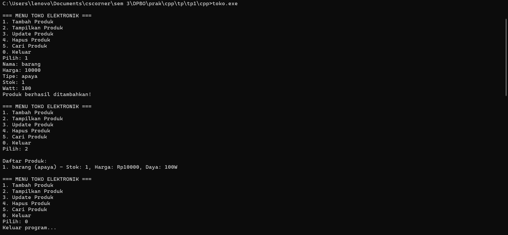
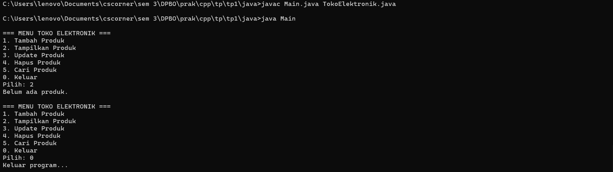
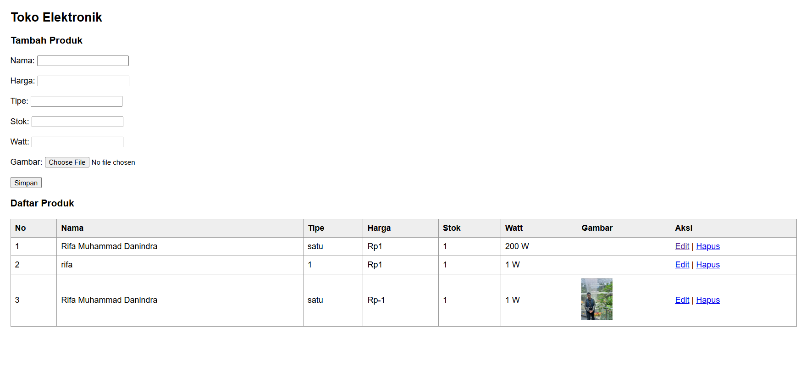
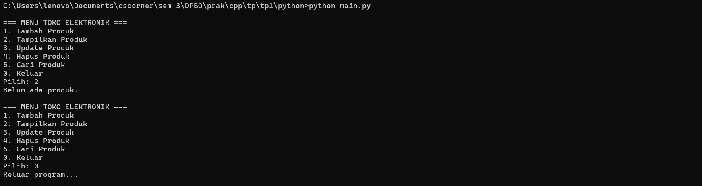

*Saya Rifa Muhammad Danindra dengan Nim  2405981 mengerjakan 
  tugas praktikum 1 dalam mata kuliah Desain dan Pemprograman Berorientasi Objek
  untuk keberkahan-Nya maka saya tidak akan melakukan kecurangan 
  seperti yang telah di spesifikasikan Aamiin.*

  Flow Kode:
C++ = file main isinya fungsi wajib yaitu tambah hapus update dll dan keluaran yang akan ditampilkan lalu pemilihan aksi yang dilakukan
      file toko elektronik isinyaatribut atribut yang ada dalam kelas toko untuk menampung data datanya
      
Python = file main isinya keluaran nya dan juga pemilihan aksi yang dilakukan. file toko isinya kelas dan atributnya dan fungsi fungsi fitur              wajib seperti tambah hapus dll.

Java = file main isinya output yang dikeluarkan dan pemanggilan fungsi aksi yang dipilih. file tokoElektronik isinya atrbiut dari classnya lalu           fungsi dari fitur wajib

Php = file toko berisi tampilan depan yang akan ditampilkan dan bisa diisi saat dibuka di web, file proses berisifungsi fungsi yang dipakai untuk melakukan fitur  crud nya

Desain = 
 nama untuk nama barang yang dijual, lalu ada harga untuk harga setiap barang nya, ada tipe untuk tipe barang elektronik yang dijual, ada stok untuk stok barang yang dijual, ada watt untuk info watt yang dipakai setiap barang

percobaan menggunakan cpp dan menambah data lalu ditampilkan

percobaan menggunakan java yaitu menampilkan data tapi belum ada data apapun

percobaan menggunakan php dengan mencoba semua fiturnya dan juga upload gambarnya

percobaan menggunakan python dengan menampilkan data tanpa memasukkan data apapun dulu

